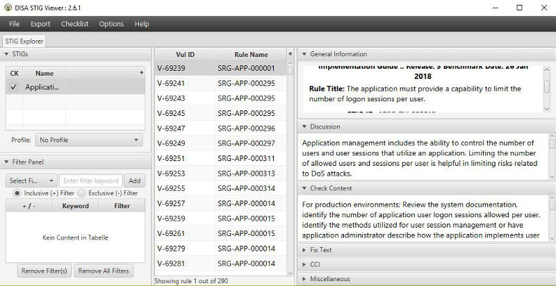

# Secure Technical Implementation Guides

The awareness for cyber security increases not only since WannaCry last year. Especially companies which operate critical infrastructure are looking for certificates which are given to secure software products by trusted authorities. One of this authorities is the Department of Defense (DoD) which provides the Information Assurance Certification and Accreditation Process DIACAP [1].

Within this process your piece of software is put to the acid test to get certified. The verification of Secure Technical Implementation Guides STIGs [2] is an essential part of this. Such a STIG depicts a configuration standard for DoD accredited systems.

No matter if you want to deal with DoD or not when you want to deliver secure software you should have a look into the available STIGs [3]. A STIG is a collection of rules, requirements and settings for many different products and systems. Especially noteworthy is the Application Security and Development STIG. The current version 4 contains 290 entries. Each one is categorized in one of three severity levels. The first level describes rules whose contempt may lead to direct loss of Confidentiality, Integrity or Availability (CIA). The second one has potential for loss and the last one may degrade protection measures. The CIA triad is a well known model in information security. It stands for the three most important protection goals. Each entry contains a detailed description of the problem as well as an explanation what might be checked during the accreditation process. You might use this to validate your own application.

When you have downloaded a STIG you can view it in the web browser of your choice or you can use the STIG Viewer [4]. The major benefit of the application is the possibility to create a checklist. In such a list you can mark rules as "violated" or "no finding". You can also adopt the severity to your needs

[1] <https://www.techopedia.com/definition/25825/dod-information-assurance-certification-and-accreditation-process-diacap>

[2] <https://iase.disa.mil/stigs/Pages/index.aspx>

[3] <https://iase.disa.mil/stigs/Pages/a-z.aspx>

[4] <https://iase.disa.mil/stigs/Pages/stig-viewing-guidance.aspx>