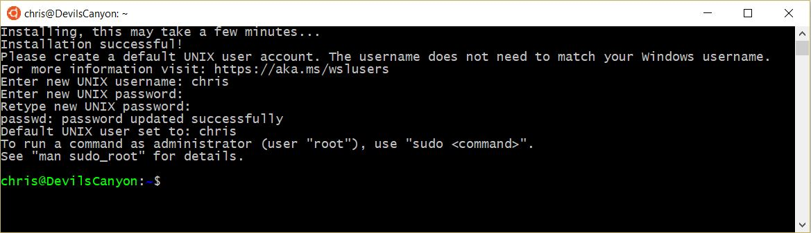

# Windows Subsystem for Linux

I never paid too much attention to the [Windows Subsystem for Linux](https://blogs.msdn.microsoft.com/wsl/2016/04/22/windows-subsystem-for-linux-overview) (WSL). But recently I wanted to do some gbd debugging. So I started with Ubuntu in Virtual Box. This was a little bit slow on my  Laptop so I searched for better solution.  What is easier than installing Ubuntu from the Windows App Store? With this app I got full Linux command line support. But how does this work?

The ability to support different subsystems was built into the Windows kernel long time ago. The first Windows NT version did support OS/2 console application for instance. Windows 10 can now run native Linux ELF64 binaries. It does this without emulation and without recompiling Linux code.

The WSL consists of user mode and kernel mode components. In kernel mode there is a driver which translates Linux system calls to the Windows kernel. Sometimes there is a direct mapping, sometimes there is some extra work to do.

In user mode there is the pico process in which system calls are dispatched to this driver. This process is an outcome of the [Drawbridge](https://www.microsoft.com/en-us/research/project/drawbridge/?from=http%3A%2F%2Fresearch.microsoft.com%2Fen-us%2Fprojects%2Fdrawbridge%2F) research prototype. A goal of this prototype was to decouple a Windows process from the underlying OS on which it is executed. This is tailor-made for running Linux applications on Windows 10. Although it was not designed for this.

To use WSL you need to active the Windows Feature “Windows-Subsystem for Linux”. This installs the basic functionality. When this is done you can install a distribution from the Microsoft Store. When I started Ubuntu the first time I saw the error message [“Unsupported console settings. In order to use this feature the legacy console must be disabled.“](http://www.winhelponline.com/blog/bash-does-not-start-unsupported-console-settings-windows-10/) constantly filling up the console window. The problem was that the legacy console was activated which is obviously incompatible to WSL.