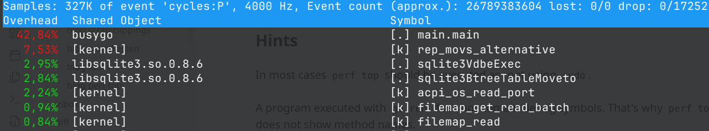
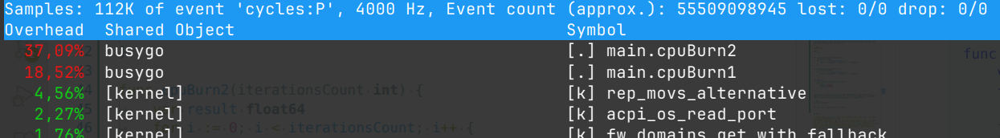

# perf top

Sometimes you might wonder why your system shows high CPU usage. While tools like `top` or `htop` can tell you which process is consuming CPU time, it is often difficult to see what the process is actually doing. However, this information is vital if you want to diagnose the problem and provide a fix.

A tool which is similar to `top` is `perf top`. Instead of processes it shows functions, typically sorted by there CPU consumption.

`perf top` works by repeatedly sampling which function a process is executing at a very high frequency. This technique is called sampling.

When `perf top` is executed, it displays a table with three columns: Overhead, Shared Object, and Symbol.  The Overhead column shows the percentage of total samples that occurred in a given function. Because sampling is statistical, a function may still appear even after it has finished executing, as long as enough samples were captured while it was running.

Here is a small example where the main method of my busygo application consume most CPU.



The following command samples all processes:

```sh
perf top
```

In the following example only the process with the PID 29370 is sampled:

```sh
perf top -p 29370
```

The above example snapshot shows that the main method consumes the most CPU.
Looking at the code this can't be true.

```go
package main

import (
	"fmt"
)

func cpuBurn1(iterationsCount int) {
	var result float64
	for i := 0; i < iterationsCount; i++ {
		result += float64(i) * float64(i) / float64(i+1)
	}
}

func cpuBurn2(iterationsCount int) {
	var result float64
	for i := 0; i < iterationsCount; i++ {
		result += float64(i) * float64(i) / float64(i+2)
	}
}

func main() {
	fmt.Println("Starting endless loop.")
	for true {
		cpuBurn1(100000)
		cpuBurn2(200000)
	}
}
```

The problem is that the compiler inlines the function. This means that he replaces the function call with the actual code. So `perf` is right. It is possible to disable inlining during compilation using the `-l` compiler switch.

```bash
go build -gcflags '-l' .
```

Now the `perf` output makes more sense.



It shows also that `cpuBurn2` consumes more CPU than `cpuBurn1`. Unfortunately 
during an on-site analysis we don't have these options.

## Hints

- In most cases, `perf top` should be executed as root using `sudo`, otherwise important samples may be missing.
- A program executed with `go run` does not contain symbols. That's why `perf top` does not show names. Same is true for an ordinary dot net application.
- In Ubuntu `perf` is broken with kernel version `6.14.0-24`. See this bug [here](https://bugs.launchpad.net/ubuntu/+source/linux-hwe-6.14/+bug/2117159). As a workaround one can use `perf` from another kernel version. For instance from here `/usr/lib/linux-tools/6.5.0-10043-tuxedo`.

**[back](../index.md)**